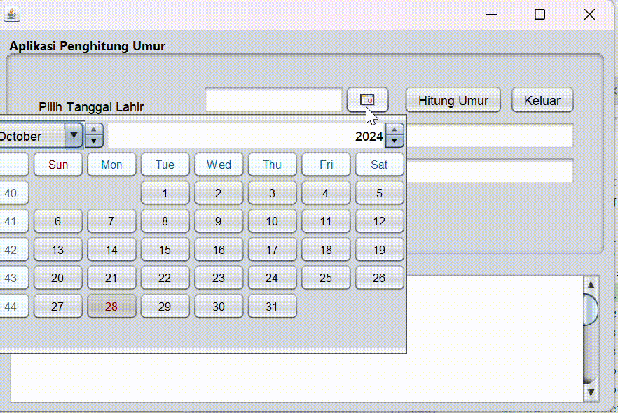

# AplikasiPenghitungUmur
 
Aplikasi Penghitung Umur adalah sebuah aplikasi berbasis Java yang membantu pengguna menghitung usia mereka dalam format yang rinci, menampilkan tanggal ulang tahun berikutnya, serta memberikan informasi peristiwa penting yang terjadi pada tanggal tersebut dalam sejarah.

# Keunggulan Aplikasi

- **Menghitung Umur**: Aplikasi ini menghitung umur pengguna dari tanggal lahir yang diinput.
- **Tanggal Ulang Tahun Berikutnya**: Menampilkan tanggal ulang tahun berikutnya beserta hari dalam Bahasa Indonesia.
- **Peristiwa Penting**: Menampilkan peristiwa penting yang terjadi pada tanggal ulang tahun berikutnya berdasarkan data yang diambil secara daring.

# Pembuat Aplikasi
 Latihan 2 - Willy Rahman(2210010103)

# Fitur

Aplikasi ini menawarkan beberapa fitur utama:

1. **Penghitungan Umur Rinci**  
   Menghitung usia pengguna dalam format yang lengkap, mencakup jumlah tahun, bulan, dan hari, berdasarkan tanggal lahir yang diinputkan.

2. **Penentuan Tanggal Ulang Tahun Berikutnya**  
   Menampilkan tanggal ulang tahun berikutnya dari pengguna, termasuk hari dalam bahasa Indonesia. Dengan ini, pengguna dapat mengetahui kapan mereka akan merayakan ulang tahun berikutnya.

3. **Peristiwa Penting pada Tanggal Ulang Tahun Berikutnya**  
   Menyediakan informasi historis tentang peristiwa penting yang terjadi pada tanggal ulang tahun pengguna dari sumber API eksternal. Fitur ini berguna untuk memberikan wawasan unik mengenai kejadian-kejadian bersejarah pada tanggal tersebut.

4. **Antarmuka Pengguna yang Sederhana dan Mudah**  
   Dibangun menggunakan Java Swing, aplikasi ini menawarkan antarmuka pengguna yang intuitif dengan input sederhana untuk memasukkan tanggal lahir dan tombol untuk memulai perhitungan.

5. **Pembatalan Pengambilan Data Asinkron**  
   Aplikasi menyediakan fungsi pembatalan untuk proses pengambilan data peristiwa penting, sehingga pengguna dapat membatalkan permintaan data jika perlu.

6. **Dukungan untuk Kustomisasi Tanggal Format**  
   Tanggal ulang tahun berikutnya ditampilkan dalam format khusus (`dd-MM-yyyy`) yang mudah dipahami dan umum digunakan di Indonesia.

## Cara Menjalankan

1. Clone repositori ini ke dalam komputer Anda atau unduh sebagai ZIP.
2. Buka proyek di IDE pilihan Anda.
3. Pastikan Anda mengatur JDK yang benar di IDE Anda.
4. Jalankan `PenghitungUmurFrame` untuk memulai aplikasi.

# Demo
 
